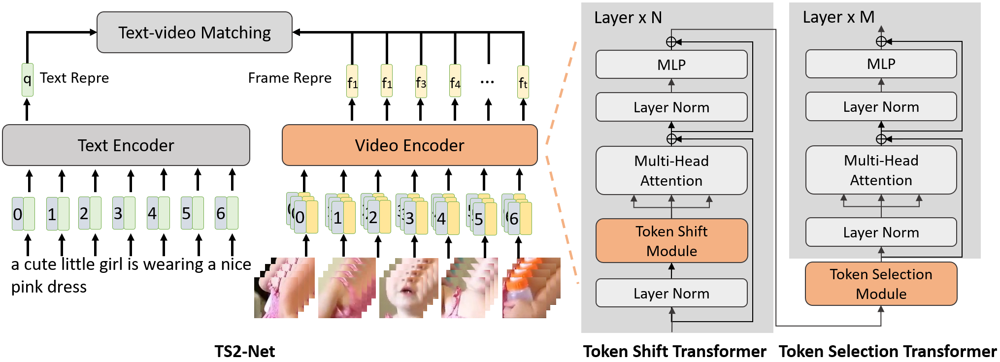
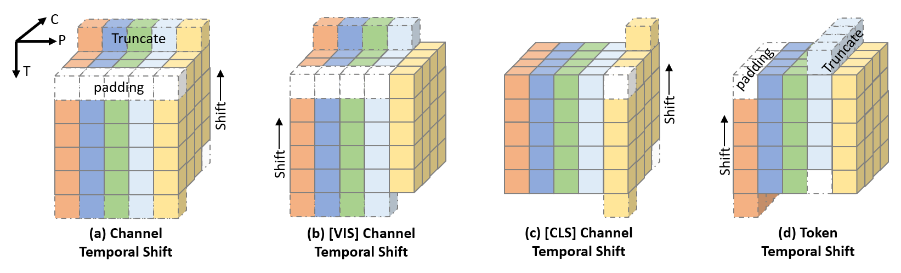
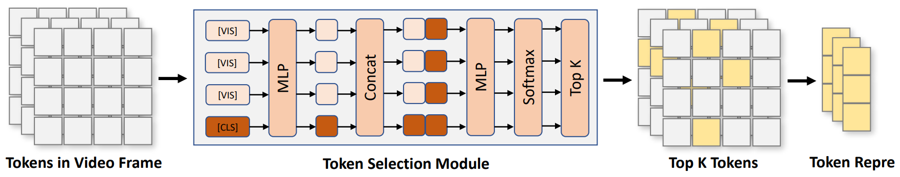

# TS2-Net: Token Shift and Selection Transformer for Text-Video Retrieval

(**Oct. 17th, 2022**) We release part of our docker file below [issue 3](https://github.com/yuqi657/ts2_net/issues/3) for reimplementation. 

Our paper is accepted by ECCV2022. Here is the [link of our paper.](https://www.ecva.net/papers/eccv_2022/papers_ECCV/papers/136740311.pdf)

This is the PyTorch code of the TS2-NET. The code has been tested on PyTorch 1.7.1.

TS2-Net is a text-video retrieval model based on [CLIP](https://github.com/openai/CLIP). With token shift transformer and token selection transformer, our model achieve SOTA performance on MSR-VTT, VATEX, LSMDC, ActivityNet, and DiDeMo. Our model achieves 54.0 R@1 on MSR-VTT test set.



The token shift operation shift all channels of a token back-and-forth, to preserve the complete token representation and enhance the interaction of adjacent frames.


The token selection module selects tokens contributes most to the local spatial semantics, to better model video representation.
(**Note**: In our released code, we manually regard [CLS] token as the most informative, which we find it can have better performance. It means that we select [CLS] token and other K-1 tokens in token selection stage.)

## Requirements
```sh
# From CLIP
conda install --yes -c pytorch pytorch=1.7.1 torchvision cudatoolkit=11.0
pip install ftfy regex tqdm
pip install opencv-python boto3 requests pandas
```

## Text-Video Retreival Results

For TS2-Net (ViT-B/32), and without inverted softmax
|Dataset|R@1|R@5|R@10|
|-|-|-|-|
|MSRVTT-1kA|47.0|74.5|83.8|
|VATEX|59.1|90.0|95.2|
|LSMDC|23.4|42.3|50.9|
|DiDeMo|41.8|71.6|82.0|
|ActivityNet|41.0|73.6|84.5|

For TS2-Net (ViT-B/16) and without inverted softmax
|Dataset|R@1|R@5|R@10|
|-|-|-|-|
|MSRVTT-1kA|49.4|75.6|85.3|

With inverted softmax
|Dataset|Model|R@1|R@5|R@10|
|-|-|-|-|-|
|MSRVTT-1kA|TS2-Net (ViT-B/32)|51.1|76.9|85.6|
|MSRVTT-1kA|TS2-Net (ViT-B/16)|54.0|79.3|87.4|

## Data Preparing 

Please refer to [ArrowLuo/CLIP4Clip](https://github.com/ArrowLuo/CLIP4Clip) to get data annotation.
For vatex, please refer to https://eric-xw.github.io/vatex-website/download.html and dataloader_vatex_retrieval.py to prepare VATEX dataset, and get the split file from https://github.com/cshizhe/hgr_v2t.

## Usage
* For msrvtt, 
```sh
sh scripts/run_msrvtt.sh
```
* For vatex,
```sh
sh scripts/run_vatex.sh
``` 
* Change DATA_PATH to your own data path
* You can change --pretrained_clip_name to ViT-B/16

### Citation
If you find this code to be useful for your research, please consider citing.
<pre>
@inproceedings{liu2022ts2net,
      title={TS2-Net: Token Shift and Selection Transformer for Text-Video Retrieval}, 
      author={Yuqi Liu and Pengfei Xiong and Luhui Xu and Shengming Cao and Qin Jin},
      year={2022},
      booktitle={Proceedings of the European Conference on Computer Vision (ECCV)},
}

@article{liu2022ts2net,
  title={TS2-Net: Token Shift and Selection Transformer for Text-Video Retrieval},
  author={Yuqi Liu and Pengfei Xiong and Luhui Xu and Shengming Cao and Qin Jin},
  year={2022},
  journal={arXiv preprint arxiv:2207.07852},
}
</pre> 

## Acknowledge
* Our code is based on [ArrowLuo/CLIP4Clip](https://github.com/ArrowLuo/CLIP4Clip)
